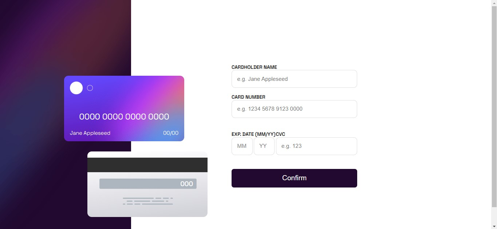

# Frontend Mentor - Interactive card details form solution

This is a solution to the [Interactive card details form challenge on Frontend Mentor](https://www.frontendmentor.io/challenges/interactive-card-details-form-XpS8cKZDWw). Frontend Mentor challenges help you improve your coding skills by building realistic projects. 

## Table of contents

- [Overview](#overview)
  - [The challenge](#the-challenge)
  - [Screenshot](#screenshot)
  - [Links](#links)
- [My process](#my-process)
  - [Built with](#built-with)
  - [What I learned](#what-i-learned)
  - [Useful resources](#useful-resources)
- [Author](#author)

## Overview

### The challenge

Users should be able to:

- Fill in the form and see the card details update in real-time
- Receive error messages when the form is submitted if:
  - Any input field is empty
  - The card number, expiry date, or CVC fields are in the wrong format
- View the optimal layout depending on their device's screen size
- See hover, active, and focus states for interactive elements on the page

### Screenshot



### Links

- Solution URL: [Add solution URL here](https://your-solution-url.com)
- Live Site URL: [Add live site URL here](https://your-live-site-url.com)

## My process

### Built with

- Semantic HTML5 markup
- CSS custom properties
- Flexbox
- CSS Grid
- Mobile-first workflow
- JavaScript

### What I learned

I've learned how to validate form and have enlarged my knowledge of JavaScript and Scss

Some code I'm proud of:
```js
requiredInputs.forEach((requiredInput, index) => {
		const error = errorElements[index]

		if (requiredInput.value.trim() == '') {
			error.style.display = 'inline'
			requiredInput.style.border = '1px solid red'
			isValid = false
		} else {
			error.style.display = 'none'
			requiredInput.style.border = '1px solid hsl(270, 3%, 87%)'
		}

		checkNumber(numberInput.value)
		checkCVC(cvcInput.value)
		checkDate(monthInput, yearInput)

	})
```

### Useful resources
- [JS documentation](https://developer.mozilla.org/en-US/docs/Web/JavaScript) - This helped with js code

## Author
- GitHub - [Skyl1te](https://github.com/Skyl1te)
- Frontend Mentor - [@Skyl1te](https://www.frontendmentor.io/profile/Skyl1te)

